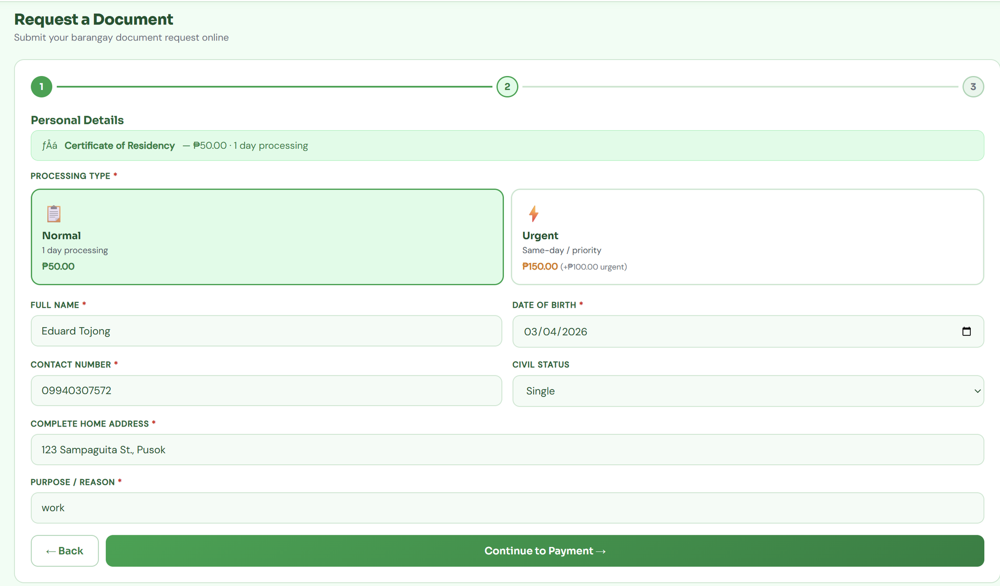

[README.md](https://github.com/user-attachments/files/26319813/README.md)
# 🏛️ BarangayConnect — Digital Barangay Services

> **Team Bisaya Bytes** · 
> Barangay Pusok, Lapu-Lapu City, Cebu

---

## 📌 Project Overview

### Problem
Residents of Barangay Pusok have to visit the barangay hall in person to request official documents like clearances and certificates — often waiting in long queues during peak hours. There is no online alternative, making the process slow and inconvenient, especially for working residents.

### Solution
**BarangayConnect** is a web-based document request system that lets residents submit, pay for, and track their barangay document requests entirely online — without needing to visit the hall until their document is ready for pickup.

### SDG Alignment
This project supports **SDG 11 — Sustainable Cities and Communities** by digitizing local government services to make them more accessible, efficient, and inclusive for all residents.

---

## ⚡ Unique Feature — Priority Tag Selection

Team Bisaya Bytes added a **Priority Tag** to the document request form. Residents can choose between:

| Tag | Processing | Fee |
|-----|-----------|-----|
| 📋 Normal | Standard (1–2 days) | Base fee only |
| ⚡ Urgent | Same-day / priority | Base fee + ₱50.00 |

The fee updates automatically on the payment step based on the selected tag.

---

## 🛠️ Tech Stack

| Layer | Technology |
|-------|-----------|
| Frontend | HTML5, CSS3, Vanilla JavaScript |
| Backend | PHP 8 |
| Database | MySQL / MariaDB |
| Payments | GCash, Maya (reference number entry) |
| Server | Apache (XAMPP / Laragon recommended) |

---

## 🚀 How to Run / Install

### Requirements
- PHP 8.0+
- MySQL 5.7+ or MariaDB 10+
- Apache web server (XAMPP or Laragon recommended)
- Any modern browser (Chrome, Firefox, Edge)

### Steps

**1. Clone the repository**
```bash
git clone https://github.com/soulrj3-create/BARANGAY-CONNECT-SYSTEM-.git
```

**2. Move to your web server root**

Place the project folder inside your server root:
- XAMPP → `C:/xampp/htdocs/`
- Laragon → `C:/laragon/www/`

**3. Import the database**

- Open **phpMyAdmin** at `http://localhost/phpmyadmin`
- Create a new database named `barangay_connect`
- Click **Import** and select `barangay_connect.sql`

**4. Configure the database connection**

Open `php/config.php` and update:
```php
define('DB_HOST', 'localhost');
define('DB_NAME', 'barangay_connect');
define('DB_USER', 'root');      // your MySQL username
define('DB_PASS', '');          // your MySQL password
```

**5. Open in browser**
```
http://localhost/BARANGAY-CONNECT-SYSTEM-/
```

---

## 🔑 Sample Credentials

> ⚠️ These are sample credentials only. Do **not** use real passwords.

| Role | Email | Password |
|------|-------|----------|
| Admin | admin@barangay.gov.ph | admin1234 |
| Resident | resident@example.com | resident1234 |

> To create the admin account, run the seed SQL included in `barangay_connect.sql`.

---

## 📸 Screenshots of Prototype

### Request Form — Priority Tag (Unique Feature)
<!-- Insert screenshot showing the Normal / Urgent priority cards -->


### Resident Dashboard
<!-- Insert screenshot of the resident dashboard -->


### Admin Dashboard
<!-- Insert screenshot of the admin dashboard -->


---

## 📁 Repository Structure

```
BARANGAY-CONNECT-SYSTEM-/
├── css/
│   └── style.css          # Global styles
├── js/
│   ├── api.js             # API utility helpers
│   ├── auth.js            # Login / Register / Logout
│   ├── requests.js        # 3-step request form + Priority Tag feature
│   ├── resident.js        # Resident portal logic
│   ├── admin.js           # Admin dashboard logic
│   └── nav.js             # Navigation and routing
├── php/
│   ├── auth.php           # Auth API endpoints
│   ├── requests.php       # Document request API
│   ├── users.php          # User/profile API
│   ├── reports.php        # Reports & settings API
│   └── config.php         # DB connection & shared helpers
├── docs/
│   └── screenshots/       # Prototype screenshots (add here)
├── index.html             # Main single-page application
├── barangay_connect.sql   # Database schema + seed data
└── README.md
```

---

## 👥 Team Bisaya Bytes

| Name | Role |
|------|------|
| Ahmad, Alshier, Y | Documentation & Pitch Lead |
| RJ Alenton | Project Manager |
| Eduard Philippe | Business Analyst |
| John Benedict R. Canon | Solution Architect |

---

> © 2025 Barangay Pusok, Lapu-Lapu City, Cebu · BarangayConnect
